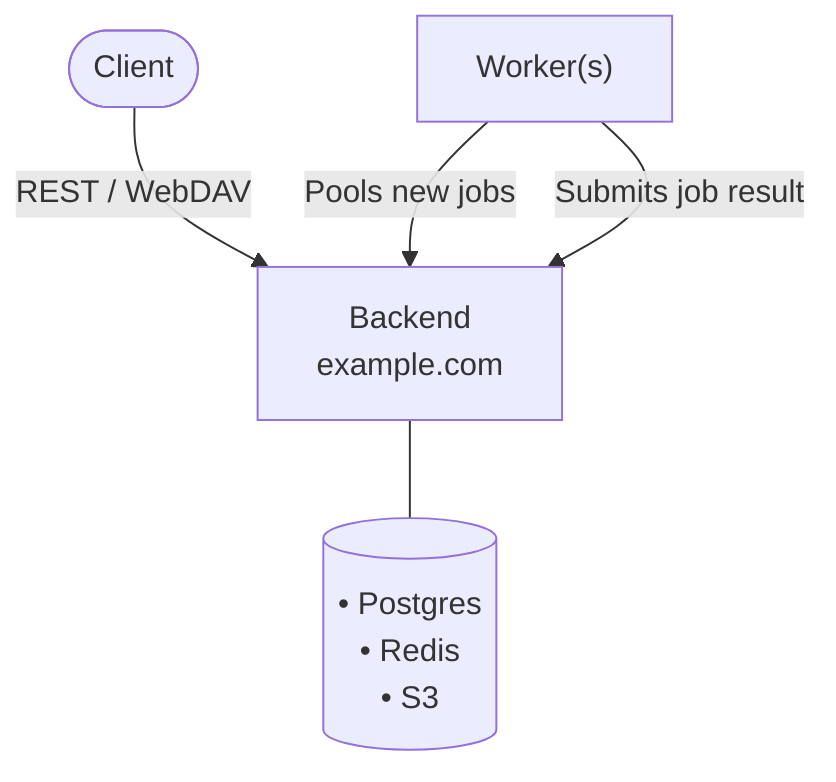
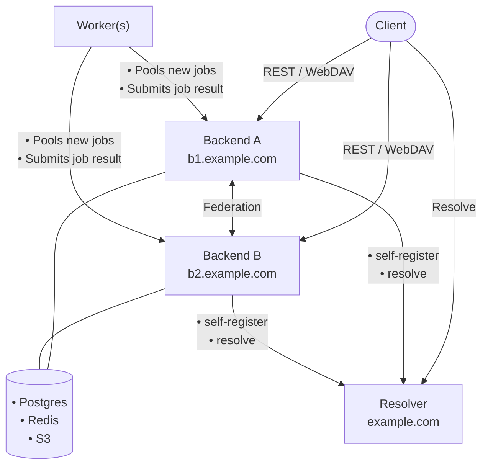

<p align="center">
  <picture>
    <source media="(prefers-color-scheme: dark)" srcset="logo/logo-dark.svg">
    <source media="(prefers-color-scheme: light)" srcset="logo/logo-light.svg">
    
  </picture>
</p>

<p align="center">
  <strong>Federated, self-hostable photo library</strong> — tag-based organization, cross-instance sharing, and WebDAV-exposed tag hierarchies.
</p>

<p align="center">
  <a href="https://github.com/ClementGre/Archypix/blob/main/LICENSE"></a>
  <a href="https://github.com/ClementGre/Archypix/actions/workflows/ci.yml"></a>
  
  <a href="https://github.com/ClementGre/Archypix/stargazers"></a>
</p>

<p align="center">
  <a href="#overview">Overview</a> •
  <a href="#features">Features</a> •
  <a href="#architecture">Architecture</a> •
  <a href="#self-hosting">Self-Hosting</a> •
  <a href="#the-story-of-archypix">Story</a> •
  <a href="#license">License</a>
</p>

---

## Overview

Archypix is a self-hosted, federated photo library. It gives you full ownership of your media while letting you interact with users on other
instances, without any central authority. Instead of rigid album structures, Archypix organizes everything around **tags**: flexible, hierarchical
labels you can assign manually or through automated rules. Your tag tree can be browsed as a virtual folder hierarchy that can be synced with any
WebDAV-compatible client or OS file manager.

Archypix uses a federated identity model: users are identified as `@username:domain`, resolved across instances via a single-hop
`/archypix-resolver/resolve` lookup.
Multiple backend instances can share a single public domain through a lightweight Resolver service, or operate independently on their own domain.

> The full feature specifications are available in [doc/01_GENERAL_SPECIFICATIONS.md](doc/01_GENERAL_SPECIFICATIONS.md).

## Features

### Tags

Hierarchical, slash-delimited paths (`/Photos/Travel/Alps`), assigned manually or by rules.

- Tagging a deep path implicitly tags all its parents too.
- Deleted pictures go to a trash with a configurable retention period.

### Automatic tagging

Rules that tag pictures on their own, re-evaluated on every upload, edit, or received share.

- **By date**: calendar segmentation: holidays, trips, nested periods.
- **By metadata**: EXIF, GPS, filename, via a predicate builder (AND/OR/NOT).
- **By shared content**: map received pictures into your own tags.

### Hierarchies

Configurable virtual folder trees built from your tags, syncable over **WebDAV**.

- Choose which tags become folders; collapse or exclude subtrees.
- Uploads, moves, and deletes through WebDAV write back to tags.

### Sharing

Federated: every instance is a peer, no central server required.

- Share a tag with a user that may be on another instance; files stay on your server.
- New pictures auto-announce; sharing is transitive and revocable anytime.
- Exif metadata can be overriden by recipient, or propagated to the original picture if permissions allows it.

**Public share links** can be created: unauthenticated, revocable links to a tag. Full originals or view-only, with optional anonymous contribution.

### A proper photo viewer

Built to browse, not just list files: responsive grid, lightbox, mobile-tuned layout.

- **Batch editing**: retag, edit EXIF, or trash a selection at once, with a dry-run preview.
- **Photos fix tools**: guided GPS/date fixing, with interpolation and suggestions.

### Versioning and storage

Any S3-compatible store (MinIO, AWS S3, Backblaze B2...), presigned URLs for downloads, per-user versioning and storage quotas.

### Roadmap

Not yet implemented, full detail in [doc/99_ROADMAP_MVP.md](doc/99_ROADMAP_MVP.md):

- **Versioning UI** — browsing and restoring picture versions.
- **ML workers** — style, people, and location-grouping inference.
- **Onboarding & opinionated defaults** — a fresh instance auto-organizes out of the box.
- **Bulk library import** — Google Takeout.
- **External shared-album import** — one-time import from Google Photos / iCloud.
- **PWA & mobile apps** — mobile-friendly PWA, then a native iOS uploader.
- **Advanced WebDAV** — directory-level move/copy/delete, real locking.
- **Visual picture editing** — crop, rotate, brightness/contrast, resize.
- **EXIF edit history** — per-picture metadata revision log.
- **Video transcoding & HLS playback** — adaptive streaming beyond today's direct playback.
- **Backup & recovery discipline** — object replication, Postgres point-in-time recovery.
- **Managed hosting** — a fully-managed `archypix.com` offering.

## Architecture

Single-backend architecture:



Two-backend architecture:



| Component                                                                 | Role                                                                                                                                                                                     |
|---------------------------------------------------------------------------|------------------------------------------------------------------------------------------------------------------------------------------------------------------------------------------|
| [**Resolver**](https://github.com/ClementGre/Archypix/tree/main/resolver) | Resolution service. Maps `@username:domain` to the owning backend, routes new registrations to the least-loaded backend, and serves a fleet admin dashboard for multi-backend operators. |
| [**Backend**](https://github.com/ClementGre/Archypix/tree/main/back)      | Axum HTTP server. Authoritative store for users, pictures, tags, and shares. Serves the REST API and WebDAV.                                                                             |
| [**Worker**](https://github.com/ClementGre/Archypix/tree/main/worker)     | Async job pool for thumbnail generation, EXIF extraction, BlurHash, file hashing. ML inference planned.                                                                                  |

A single backend serves its own resolution endpoint, so the Resolver is only needed once you run more than one backend behind the same domain.

## Self-Hosting

Archypix is deployed with Docker Compose. Every instance needs Postgres, Redis, and an S3-compatible object store, plus a reverse proxy (Traefik in
the example)
for TLS and routing.

### Single backend (recommended)

The simplest setup, and the right starting point for almost everyone: [`docker-compose.yml`](docker-compose.yml) at the repo root bundles
Postgres, Redis, MinIO, one backend, one worker, and the frontend into a single stack (no Resolver needed, a lone backend answers its own
`/archypix-resolver/info` and `/archypix-resolver/resolve`).

The example expects an existing Traefik reverse proxy reachable on an external `traefik` Docker network, and DNS records pointed at your host for
three
separate domains:

- `GLOBAL_DOMAIN`: your federated identity domain (`@username:GLOBAL_DOMAIN`). Only the `/archypix-resolver` path is forwarded from it, straight
  to the backend, so the rest of the domain is free for a landing page or anything else.
- `FRONT_DOMAIN`: serves the web app.
- `BACK_DOMAIN`: serves the backend API/WebDAV (everything except resolution). Can equal `GLOBAL_DOMAIN`, but a separate subdomain keeps your
  identity domain free of infrastructure-looking URLs.

Plus `S3_DOMAIN` for MinIO: presigned download/upload URLs are handed straight to the browser, so object storage needs to be publicly reachable
too.

```bash
git clone https://github.com/ClementGre/Archypix.git
cd Archypix
cp .env.example .env   # fill in domains, passwords, and secrets
docker compose up -d
```

Don't want to run your own frontend? Drop the `front` service from `docker-compose.yml` and use the hosted client at
[archypix.com](https://archypix.com) instead — point it at your `BACK_DOMAIN`, and add `https://archypix.com` to `CORS_ORIGINS` so your backend
accepts requests from it.

See [`.env.example`](.env.example) for every variable, and [doc/02_INFRASTRUCTURE_DESIGN.md](doc/02_INFRASTRUCTURE_DESIGN.md) for what each
component does.

### Multiple backends behind one domain

Once a single backend's resource limits actually matter, add a
Resolver in front of several backends sharing one public domain (`@user:example.com` resolves to whichever backend owns that user).
[`docker/docker-compose.prod.yml`](docker/docker-compose.prod.yml) is a worked example of this topology: a resolver, two backends, a shared
worker, and a frontend, all behind Traefik, using external Postgres/Redis/Traefik Docker networks and per-backend MinIO buckets. Adapt its
environment variables and Traefik labels to your own domains and secrets.

## The Story of Archypix

### December 2022 — PicturesManager

The project started as [**PicturesManager**](https://github.com/ClementGre/PicturesManager), a desktop photo manager built
with [Tauri](https://tauri.app/). The stack was unusual by choice: a Rust backend coupled with a Rust [WebAssembly](https://webassembly.org/) frontend
written in [Yew](https://yew.rs/), fast, safe, and entirely in one language. The core idea was already there: automatic grouping rules to organize
pictures without manual effort.

### March 2024 — PMCloud

[**PMCloud**](https://github.com/ClementGre/PMCloud) moved the project to the cloud. The desktop shell was dropped in favor of
a [Vue.js](https://vuejs.org/) web frontend backed by a [Rocket](https://rocket.rs/) API and [Diesel](https://diesel.rs/) ORM. The signature feature
of this iteration was shared groups: multiple users could collaborate on the same event's pictures while each keeping their own automatic grouping
rules applied on top.

### January 2025 — Archypix (first generation)

The project was rebranded as **Archypix** — *Archy* for the structured, architectural way it lets you organize your library, *pix* for pictures. The
technology stack was carried forward and the codebase underwent a major
refactoring ([back](https://github.com/ClementGre/old-archypix-app-back) / [front](https://github.com/ClementGre/old-archypix-app-front)), laying
groundwork for the ambitions of the next phase.

### January 2026 — Archypix (current, from scratch)

Development restarted from a blank slate with an entirely new specification. The central breakthrough: Archypix became **decentralized**. Instances
are peers — any instance can share with any other, world-wide, without a central registry. A single public domain can host multiple backend instances
for scaling or migration, and completely independent domains federate natively. The tagging model was redesigned around hierarchical paths and
automated pipelines, and hierarchies were introduced as the primary way to browse and sync the library.

This is the Archypix we are building today, and there is a lot left to implement. Contributions and ideas are very welcome.

## License

Archypix is released under the [GNU Affero General Public License v3.0](https://github.com/ClementGre/Archypix/blob/main/LICENSE).

In short: you are free to use, modify, and distribute Archypix, but any modified version you run as a network service must also be made available
under the same license.
